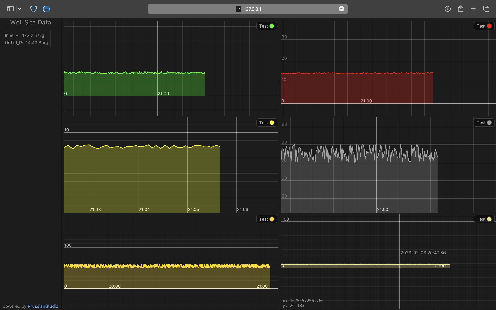
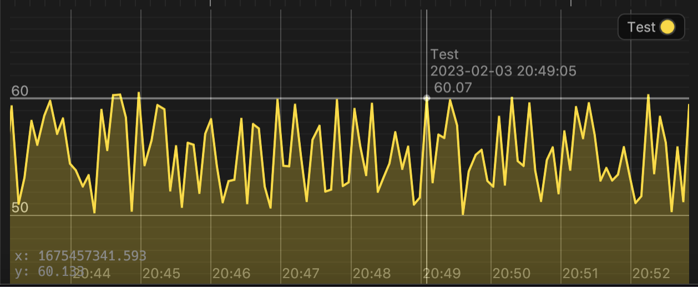

## Visualizing Data

PrussianStudio comes with Dashboards which is a highly interactive application that allows the user to interact with engineering data in the form of trends.

## Interacting with Trends

The user can easily follow the development of engineering data such as the change in pressure or temperature by interacting directly with the trends by zooming, panning or dragging the data plot.
The whole application runs at around 60 frames per second which makes it very responsive. 

