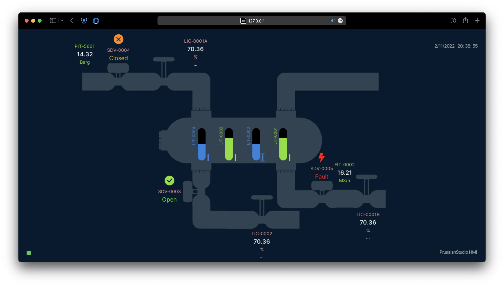

## The Human Machine Interface

The HMI in PrussianStudio is what we use to monitor and control our industrial process. It can either run natively or on the browser.

HMI is built with the Godot game engine. The above picture shows a simple process, but the software is capable of running complex visualizations in 2D and 3D.