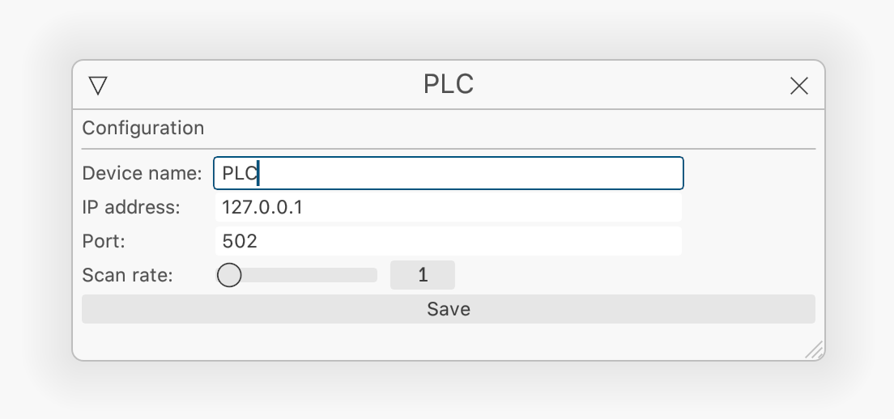
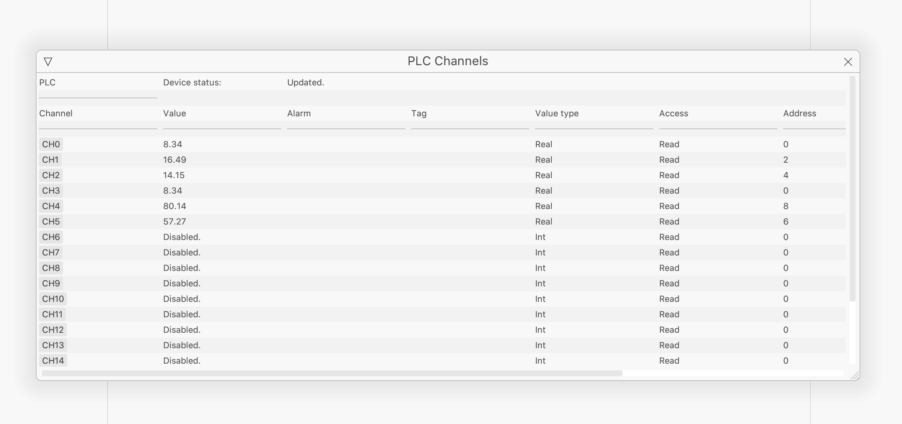
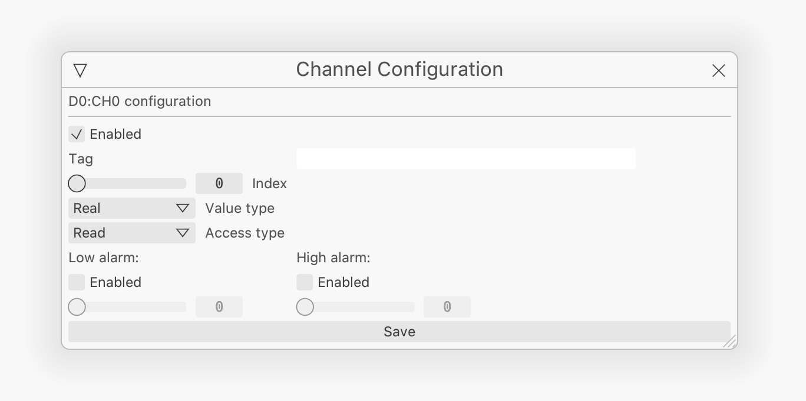

## Nano Map

Nano uses internal windows to show options.

## Device Configuration

To configure a device go to **Devices** and then chose the device you want to configure. Nano supports 2 devices by default, but that can be increased in the full version.

The configuration options are simple. Enter the Modbus device IP address and the port which defaults to 502.

The scan rate is how long Nano should wait before requesting data from the device. Defaults to <code>1 second</code>.

When you press the **Save** button the device will automatically reconfigured.

:::note

**Nano** supports serial communication but it is still not tested yet.

:::

## Channels

Each device can hold a number of channels (20 in the limited version and 1000 in the full version).

## Channel Configuration

To configure a channel press the button with the channel's id.

Every channel comes disabled by default. 

